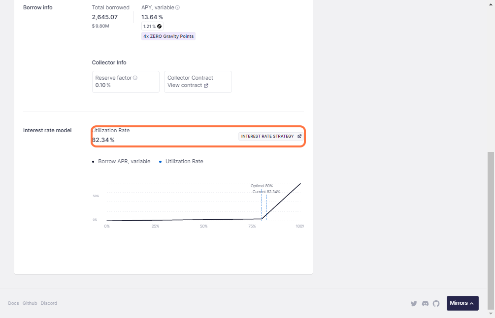

# Parameters

### **Max LTV (Loan to Value)**

The Loan to Value ratio represents the maximum amount you can borrow against your collateral. It's expressed as a percentage of the collateral's value.

For instance, $WETH has an 80% LTV on ZeroLend's Linea Market. Here, you can borrow 0.8 $WETH for every $WETH you deposit as collateral on ZeroLend.&#x20;

<figure><figcaption></figcaption></figure>

#### How LTV Works:

* If an asset has an LTV of 75%, you can borrow up to 75% of your collateral's value
* Example: With $10,000 worth of ETH as collateral at 75% LTV:
  * Maximum borrowing capacity = $10,000 × 75% = $7,500
* Different assets have different LTV ratios based on their volatility and risk profile
* Stablecoins typically have higher LTVs than volatile assets

#### Formula

$$
LTV = (Borrowed Amount / Collateral Value) × 100%
$$

### Health Factor

A key risk metric that represents the safety of your borrowed position relative to your collateral value and liquidation threshold.

<figure><figcaption></figcaption></figure>


#### **Formula**

$$
Health Factor = (Collateral Value × Liquidation Threshold) / Total Borrowed Value
$$

#### Health Factor Interpretation:

* Health Factor > 1: Position is safe
* Health Factor = 1: Position at liquidation point
* Health Factor < 1: Position can be liquidated

#### Example Health Factor Calculation:

_Scenario_:

* Collateral: $10,000 ETH
* Liquidation Threshold: 82%
* Borrowed: $7,000 USDC

$$
Health Factor = ($10,000 × 82%) / $7,000 = 1.17
$$

###

### Utilization Rate

Measures how much available capital in a lending pool is currently being borrowed.

<figure><figcaption></figcaption></figure>

$$
Utilization Rate = (Total Borrowed / Total Available) × 100%'
$$

### Impact on Protocol:

* Influences interest rates dynamically
* Higher utilization → Higher interest rates
* Optimal utilization target: 80%


The interest rate model adjusts to maintain balanced utilization


#### Interest Rate Correlation:

* Low utilization (<80%): Gradual APY increase
* High utilization (>80%): Steep APY increase to encourage repayments
* Maximum utilization (>95%): Emergency APY levels

### **Liquidation Threshold**

The Liquidation Threshold is the percentage at which your position becomes eligible for liquidation. It's always higher than the LTV to provide a safety buffer.

For example, on ZeroLend's Linea Market, the liquidation threshold for $WETH loans is 82.50%. If your $WETH debt value becomes worth 82.50% of your deposited collateral, the protocol can sell the collateral to repay the loan.


<figure><figcaption></figcaption></figure>

#### Key Points:

* Represents the maximum ratio of borrowed amount to collateral before liquidation
* Creates a safety margin between maximum borrowing capacity and liquidation point
* Example: If ETH has:
  * LTV: 75%
  * Liquidation Threshold: 82% This creates a 7% buffer zone between maximum borrowing and liquidation

#### Safety Buffer Calculation

$$
Safety Buffer = Liquidation Threshold - LTV
$$


### **Liquidation Penalty**

A fee charged during liquidation events is added to the amount that must be repaid.

<figure><figcaption></figcaption></figure>


### **Utilization Rate**

This is the percentage of funds currently being borrowed compared to the total funds available. For example, a utilization rate of 82.34% means that out of all the funds available to be lent out, 82.34% are currently borrowed by users. This rate can affect the interest rates charged on the loans. The higher the utilization rate, the higher the interest rates, as the demand for the funds is higher relative to the supply.

<figure><figcaption></figcaption></figure>

### **Health Factor**

The health factor indicates the liquidation risk. A health factor above 1 means you are not at immediate liquidation risk. If the health factor falls below 1, the loan is undercollateralized and may be liquidated. You can check your loan's health factor under your ZeroLend 'Dashboard.'

<figure><figcaption></figcaption></figure>

### Formula:

$$
Health Factor = (Collateral Value × Liquidation Threshold) / Total Borrowed Value
$$

### Health Factor Interpretation:

* Health Factor > 1: Position is safe
* Health Factor = 1: Position at liquidation point
* Health Factor < 1: Position can be liquidated

### Example Health Factor Calculation:

```
Scenario:
- Collateral: $10,000 ETH
- Liquidation Threshold: 82%
- Borrowed: $7,000 USDC

Health Factor = ($10,000 × 82%) / $7,000 = 1.17
```

### Utilization Rate

Measures how much of the available capital in a lending pool is currently being borrowed.

<figure><figcaption></figcaption></figure>


### Formula:

```
Utilization Rate = (Total Borrowed / Total Available) × 100%
```

### Impact on Protocol:

* Influences interest rates dynamically
* Higher utilization → Higher interest rates
* Optimal utilization target: 80%
* The interest rate model adjusts to maintain balanced utilization

### Interest Rate Correlation:

* Low utilization (<80%): Gradual APY increase
* High utilization (>80%): Steep APY increase to encourage repayments
* Maximum utilization (>95%): Emergency APY levels

***

## Liquidation Threshold

The Liquidation Threshold is the percentage at which your position becomes eligible for liquidation. It's always higher than the LTV to provide a safety buffer.

<figure><figcaption></figcaption></figure>


### **Key Points:**

Represents the maximum ratio of the borrowed amount to collateral before liquidationCreates a safety margin between maximum borrowing capacity and liquidation point&#x20;

* Example: If ETH has:
  * LTV: 75%
  * Liquidation Threshold: 82% This creates a 7% buffer zone between maximum borrowing and liquidation

### **Safety Buffer Calculation:**

```
Safety Buffer = Liquidation Threshold - LTV
```

#### Important Aspects:

* Typically ranges from 5% to 15% depending on asset risk
* Applied to the portion of the position being liquidated
* Covers protocol risks and incentivizes liquidators

#### Example:

* Borrowed Amount: $1,000
* Liquidation Penalty: 10%
* During liquidation, borrower loses:

```
Additional Cost = $1,000 × 10% = $100
Total Liquidation Cost = $1,000 + $100 = $1,100
```

***

## **Liquidation Penalty**

A fee charged during liquidation events, added to the amount that needs to be repaid.


## **Important Aspects:**

* Typically ranges from 5% to 15% depending on asset risk
* Applied to the portion of the position being liquidated
* Covers protocol risks and incentivizes liquidators

**Example:**

* Borrowed Amount: $1,000
* Liquidation Penalty: 10% During liquidation, the borrower loses:

```
Additional Cost = $1,000 × 10% = $100 Total Liquidation Cost = $1,000 + $100 = $1,100
```

## Liquidation Process

<figure><figcaption></figcaption></figure>

### How Liquidation Works

1. The position becomes eligible for liquidation when Health Factor < 1
2. Liquidators can repay part or all of the borrowed amount
3. Liquidators receive collateral at a discount (Liquidation Penalty)
4. Original borrower loses collateral equal to:

```
Lost Collateral = (Repaid Amount × (1 + Liquidation Penalty)) / Collateral Price
```

***

## Risk Management Guidelines

### Maintaining a Safe Position

1. **Monitor Health Factor:**
   * Recommended: Keep Health Factor > 1.5
   * Critical Zone: Health Factor < 1.2
   * Danger Zone: Health Factor < 1.1
2. **Risk Mitigation Strategies:**
   * Maintain lower LTV than the maximum allowed
   * Diversify collateral types
   * Set up Health Factor alerts
   * Keep additional collateral ready
3. **Actions to Improve Health Factor:**
   * Repay part of the borrowed amount
   * Add more collateral
   * Swap to more stable collateral assets

## Avoiding Liquidation

1. **Proactive Monitoring:**
   * Regular Health Factor checks
   * Price movement alerts
   * Market volatility awareness
2. **Safety Buffers:**
   * Maintain Health Factor > 1.5
   * Keep emergency funds available
   * Use stablecoins for lower volatility
3. **Emergency Actions:**
   * Flash loan options for quick repayment
   * Collateral swaps to stable assets
   * Partial position closure
