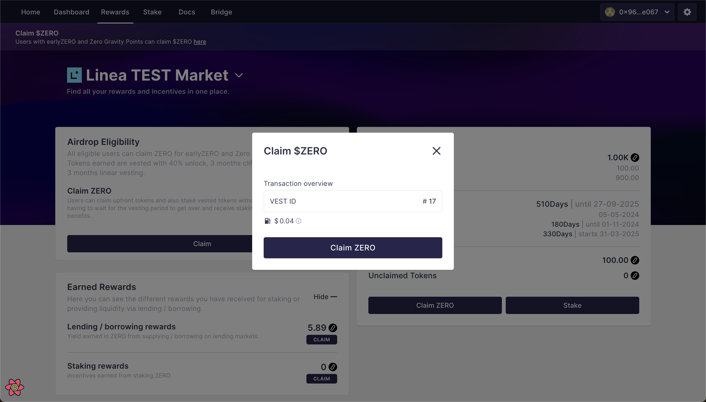

# Zeronomics

**$ZERO** is a scarce ERC20 token with a maximum circulation of 10 billion tokens. The majority of **$ZERO** tokens have been allocated to support community and ecosystem-related initiatives, reflecting **$ZERO**'s commitment to being a coin governed and controlled by its community.

To achieve a high level of distribution and decentralization among token holders, the token supply will be gradually released over a 100-year period.&#x20;

## Token Distribution

<figure><figcaption></figcaption></figure>
