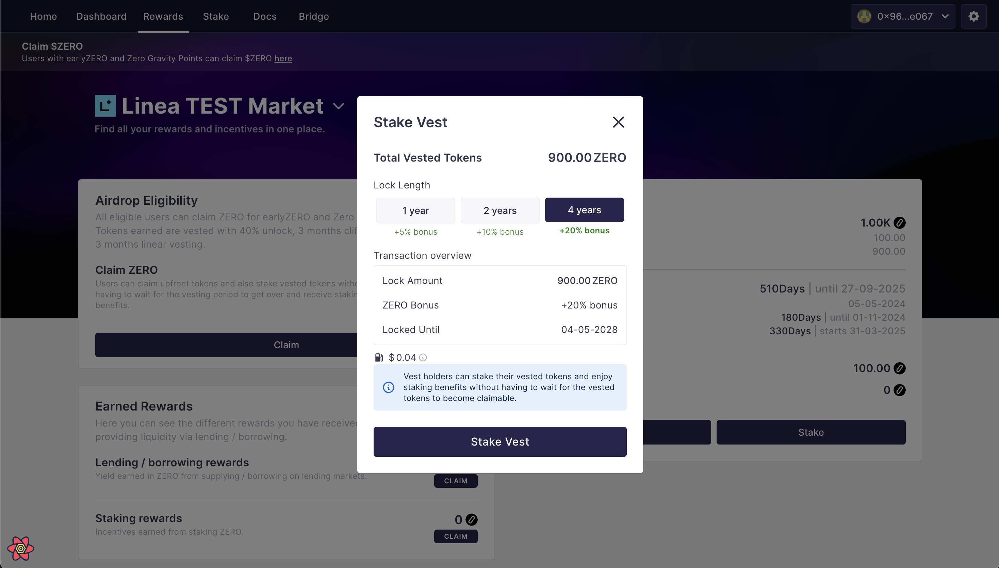

# Claim ZERO


$ZERO allocation for users who redeem their Zero Gravity points or $earlyZERO tokens for $ZERO follows the same vesting schedule:&#x20;

* 40% of the airdrop allocation will be distributed upfront to users.&#x20;
* The remaining 60% will have a 6-month cliff and 3-month linear vesting schedule


ZeroLend users and investors can claim the upfront $ZERO tokens and stake the remaining tokens.&#x20;

Let's dive into the 2 categories of users and the step-by-step guide for both:&#x20;

* Airdrop users
* Investors&#x20;

***

### Airdrop Users&#x20;

All eligible airdrop users can claim $ZERO against their $earlyZERO tokens and Zero Gravity points.&#x20;

Your $ZERO allocation will depend on the $earlyZERO tokens and Zero Gravity points you have accumulated. It will be automatically converted to ZERO on launch, and users will only be able to see their final ZERO airdrop.&#x20;

<figure><figcaption></figcaption></figure>

Please note that we have allocated a major portion of the $ZERO airdrop to the liquidity providers on our lending markets.&#x20;


Tokens earned are vested with 40% unlock, 3 months cliff, followed by 3 months linear vesting.


Users can claim upfront tokens and stake vested tokens without waiting for the vesting period to end, and they will receive staking benefits.

#### Here's a simple guide that users can refer to for claiming:&#x20;

Step 1: Go to the rewards tab on app.zerolend.xyz and connect your wallet.

Step 2: Your accumulated ZERO will show under the airdrop section.

Step 3: Click on the **Claim** button. This will open up a claim modal.&#x20;

<figure><figcaption></figcaption></figure>

Step 5: After confirming the details on this screen, you can click on the claim ZERO button &#x20;

<figure><figcaption></figcaption></figure>

Step 6: Confirm the transactions on your wallet. &#x20;

After claiming, you will receive the claimed ZERO tokens on your wallet and the rest of the vested tokens will be converted into a vest and be visible on the same rewards tab.&#x20;


[If you fail to claim your airdrop tokens for 30 days from May 06, 2024 (TGE), your tokens will be returned to the treasury. ](#user-content-fn-1)[^1]


***

### Private Sale Investors

Investors, advisors, and all individuals can claim their tokens via vests on the Rewards tab.&#x20;

<figure><figcaption></figcaption></figure>

Investors will receive a vest showing their allocation with the cliff duration, vesting period, and all the other details here before TGE.

Similar to airdrop users, investors can claim upfront tokens and stake vested tokens without waiting for the vesting period to end and receive staking benefits.

#### Here's a simple guide that investors can refer to:&#x20;

Step 1: Go to the rewards tab on app.zerolend.xyz and connect your wallet.

Step 2: Your vest will show up here:

<figure><figcaption></figcaption></figure>

Step 3: Investors have an option to:

**Claim - this will claim your upfront tokens in your wallet.**

<figure><figcaption></figcaption></figure>

Step 4a: Click on the **claim** button.

Step 4b: Confirm transactions on your wallet.

OR&#x20;

**Stake—This will stake any unclaimed upfront tokens and the rest of the vested tokens that have yet to be unlocked.**

<figure><figcaption></figcaption></figure>

Step 4a: Click on the **Stake Vest** button

Step 4b: Confirm transactions on your wallet.

Once you staked, your positions will be visible under the stake page as an NFT.&#x20;

[^1]: 
