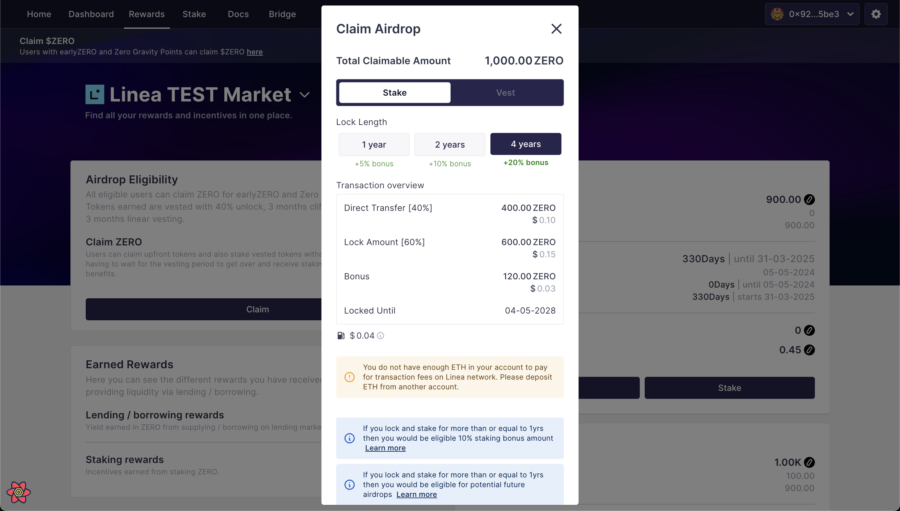
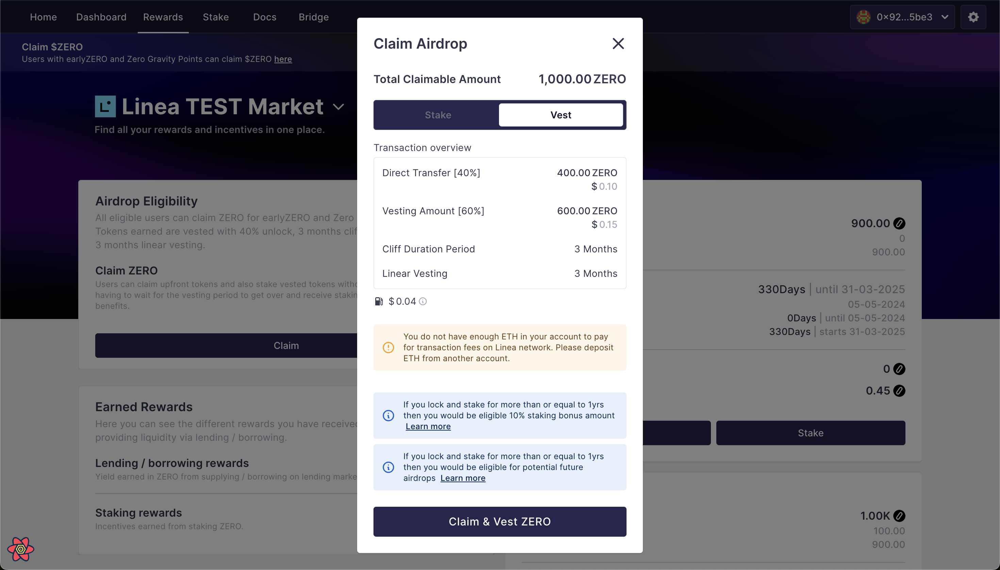

# Claim $ZERO


$ZERO allocation for users who redeem their Zero Gravity points or $earlyZERO tokens for $ZERO follows the same vesting schedule:&#x20;

* 40% of the airdrop allocation will be distributed upfront to users.&#x20;
* The remaining 60% will have a 6-month vesting schedule - 3 months cliff and 3-months linear vesting


ZeroLend users and investors can claim the upfront $ZERO tokens and stake / vest the remaining tokens.&#x20;

Lets dive into the 2 categories of users and the step-by-step guide for both:&#x20;

* Airdrop users
* Investors&#x20;

***

### Airdrop Users&#x20;

All eligible airdrop users can claim $ZERO against their $earlyZERO tokens and Zero Gravity points.&#x20;

Your $ZERO allocation will depend on the $earlyZERO tokens and Zero Gravity points you have accumulated and will be automatically converted to ZERO on launch and users will only be able to see their final ZERO airdrop.&#x20;

<figure><figcaption></figcaption></figure>

Please note that we have allocated a major portion of the $ZERO airdrop to the liquidity providers on our lending markets.&#x20;


Tokens earned are vested with 40% unlock, 3 months cliff, followed by 3 months linear vesting.


Users can claim upfront tokens and stake vested tokens without waiting for the vesting period to end, and they will receive staking benefits.

Here's a simple guide that users can refer to:&#x20;

Step 1: Go to the rewards tab on app.zerolend.xyz and connect your wallet &#x20;

Step 2: Your accumulated ZERO will show under the airdrop section&#x20;

Step 3: Click on the Claim button. This will open up a modal where users can either:&#x20;

<figure><figcaption></figcaption></figure>

**Claim and Stake - this will claim your upfront tokens in your wallet and stake the rest of the vested tokens.**&#x20;

<figure><figcaption></figcaption></figure>

Step 4a: Click on the claim and stake button&#x20;

Step 4b: Confirm transactions on your wallet&#x20;

OR&#x20;

**Claim and Vest - this will claim your upfront tokens in your wallet and vest the rest of the vested tokens.**&#x20;

<figure><figcaption></figcaption></figure>

Step 4a: Click on the claim and vest button&#x20;

Step 4b: Confirm transactions on your wallet&#x20;


[If you fail to claim your airdrop tokens for 30 days from May 06, 2024 (TGE), your tokens will be returned back to the treasury. ](#user-content-fn-1)[^1]


***

### Private Sale Investors

Investors, advisors, and all individuals can claim their tokens via vests on the Rewards tab.&#x20;

<figure><figcaption></figcaption></figure>

Investors will receive a vest showing their allocation with the cliff duration, vesting period, and all the other details here before TGE

Similar to airdrop users, investors can claim upfront tokens and stake vested tokens without waiting for the vesting period to end and receive staking benefits.

Here's a simple guide that investors can refer to:&#x20;

Step 1: Go to the rewards tab on app.zerolend.xyz and connect your wallet &#x20;

Step 2: Your vest will show up here

<figure><figcaption></figcaption></figure>

Step 3: Investors have an option to:

Claim - this will claim your upfront tokens in your wallet

<figure><figcaption></figcaption></figure>

Step 4a: Click on the claim button&#x20;

&#x20;Step 4b: Confirm transactions on your wallet&#x20;

OR&#x20;

Stake - this will stake the rest of the vested tokens that are not yet unlocked.

Step 4a: Click on the Stake Vest button

<figure><figcaption></figcaption></figure>

Step 4b: Confirm transactions on your wallet&#x20;

[^1]: 
