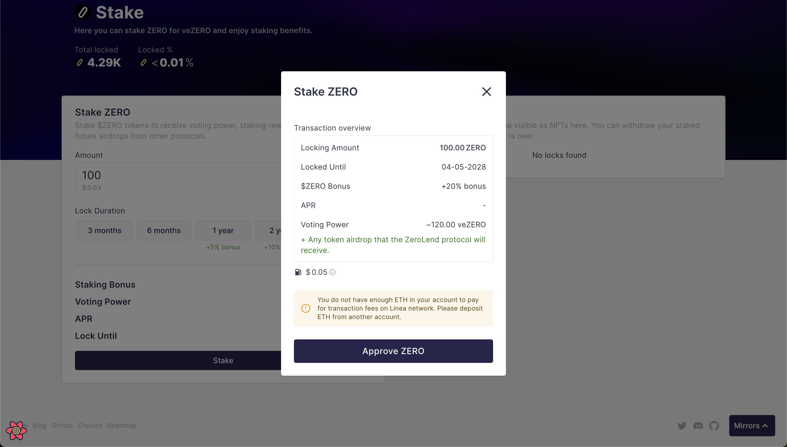

# Stake ZERO

$ZERO stakers receive voting power, staking rewards, and potential future airdrops from other protocols based on their voting power.&#x20;

Your veZERO or voting power is based on the number of tokens you stake and for the period you stake it.&#x20;

You receive a staking bonus of 5-20% if you stake for longer than 1 year. &#x20;

There are two ways you can stake:&#x20;

* Stake tokens&#x20;
* Stake vests&#x20;

After staking, your active staking position will show as NFTs on the same page.&#x20;

***

### Stake your Tokens&#x20;

If you have ZERO tokens in your wallet you can stake it through this section.&#x20;

<figure><figcaption></figcaption></figure>

#### Here's the step-by-step guide on how you can stake your tokens&#x20;

Step 1: Connect your wallet to app.zerolend.xyz&#x20;

If you don't have ZERO tokens, you can buy them from a CEX or DEX like Lynex on Linea (CA: [https://lineascan.build/address/0x78354f8dccb269a615a7e0a24f9b0718fdc3c7a7](https://lineascan.build/address/0x78354f8dccb269a615a7e0a24f9b0718fdc3c7a7))

Step 2: Go to the Stake page on the app&#x20;

<figure><figcaption></figcaption></figure>

Step 3: Input the number of tokens you would like to stake.

Step 4: Click on **Stake.**

Step 5: Click on **Approve ZERO.**

<figure><figcaption></figcaption></figure>

Step 6: Confirm the transactions on your wallet&#x20;

***

### Stake your Vest&#x20;

Vest holders can stake their vested tokens and enjoy staking benefits without having to wait for the vested tokens to become claimable.&#x20;

Your vests will show on the Rewards tab. Here are the steps you need to take to stake your vest:&#x20;

<figure><figcaption></figcaption></figure>

Step 1: Go to the rewards tab on app.zerolend.xyz&#x20;

Step 2: If you have an active vest (tokens that are in vesting), they will show here:

<figure><figcaption></figcaption></figure>

Step 3: Click on **Stake**, and it will open a modal&#x20;

<figure><figcaption></figcaption></figure>

Step 4: Click on Stake Vest&#x20;

Step 5: Confirm the transactions on your wallet&#x20;

***

### Your Staking Positions

Your staking positions will be visible as NFTs here. You can withdraw your staked tokens after the lock period is over.

<figure><figcaption></figcaption></figure>

