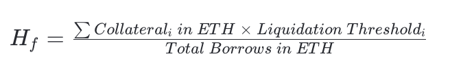

# Farming $VS on veSync

<figure><figcaption>
<a href="https://twitter.com/zerolendxyz/status/1693578810393067832">https://twitter.com/zerolendxyz/status/1693578810393067832</a>
</figcaption></figure>

## What is veSync?

[veSync](https://vesync.finance/) is a community-driven, ve(3,3) DEX built on the zkSync network combining liquidity, voting, and rewards in a single application. At the core of veSync is the $VS token. Users can stake $VS for $veVS to vote on emissions and earn bribes.

To learn more about veSync, visit their [website](https://vesync.finance/) and go through their [documentation](https://docs.vesync.finance/introduction/vesync). To learn more about the rewards you can earn from veSync read the [Rewards Documentation](https://docs.vesync.finance/liquidity-and-vote-and-reward/rewards).

## How to provide liquidity?

Providing liquidity is very easy to do on veSync. Users need to first make sure they have [assets on zkSync](../getting-your-assets-onto-zksync.md) and have [minted the ONEZ stablecoin](../how-to-mint-the-onez-stablecoin.md).


[how-to-mint-the-onez-stablecoin.md](../how-to-mint-the-onez-stablecoin.md)


Once you have deposited assets you can then visit the veSync website and visit any one of the pools that is paired with ONEZ and has an active gauge.

The following pools are currently available on veSync&#x20;

* ONEZ/USDC Stable Pool: [https://app.vesync.finance/liquidity/0xeb73fc57b6cd73bc2e36fa7d9265cb9d4eccbdd6](https://app.vesync.finance/liquidity/0xeb73fc57b6cd73bc2e36fa7d9265cb9d4eccbdd6)
* ONEZ/ETH Volatile Pool: [https://app.vesync.finance/liquidity/0xc562eb13fe426e0091d682c79bb3c2901b6fc092](https://app.vesync.finance/liquidity/0xc562eb13fe426e0091d682c79bb3c2901b6fc092)

Once you have opened the liquidity page, proceed to add how much tokens you'd like to deposit into LP and then click on the Deposit & Stake button to provide liquidity

<figure><figcaption>
A screenshot of the deposit screen
</figcaption></figure>

And that's it! You are now providing liquidity to veSync and the $ONEZ stablecoin and farming LP rewards!
